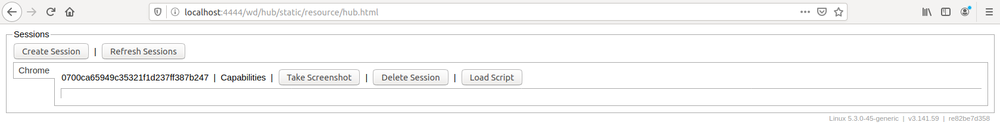

# data_loader
## Environment Setup
Things we need to install before conducting scrapping:
- Anaconda environment from environment.yml [Sasha's notebook]("https://dev.azure.com/skAInetDarkAvenger/DarkAvenger/_git/KaggleScrapper?path=%2FREADME.md&_a=preview")
- **Docker**
- Linux system
### How to install docker on linux
To run the docker images, we need to install the docker engine.
[Firstly, we have to prepare a repository.]('https://docs.docker.com/install/linux/docker-ce/ubuntu/#install-using-the-repository')<br>
Docker recommends it, because it's the easiest way to install, there is also a possiblity to <br>
create a docker from DEB package - only for a specific needs.<br>
We go to the next section called Install Docker Engine - Community, and follow each command.<br>
**It is worth to execute the last command in case of sanity check** <br>
(*maybe* I attach the script to do it automatically)<br>
### Use Standalone-Selenium-Server image within the docker
Use below command to download and run the selenium server
```shell script
sudo docker run --restart=always -d -p 4444:4444 -v /dev/shm:/dev/shm selenium/standalone-chrome:3.141.59-20200409
```
**-d** detached; starts the container (Selenium Server) in the background<br>
**-p** published container's port to the host. The schema is **host_port:container_port**<br>
**-v** is used for mounting volumes between host and image. The schema is **host_path:container_path** <br>
**DISCLOUSURE**<br>
If we do not add mounting between host's /dev/shm folder and container's /dev/shm folder, it will cause errors, because<br>
Container's /dev/shm is an implementation of shared memory concept. <br>
Shared memory is memory that may be accessed by multiple programs.<br>
It is efficient for passing data between programs.<br>
**selenium/standalone-chrome:3.141.59-20200326** finally we specify the image name with the semicolon and the version of image<br>
### Connect to Selenium's Image using Python
Code below shows how to connect to selenium's image
```python
## essential libraries to import
from selenium import webdriver
from selenium.webdriver.common.desired_capabilities import  DesiredCapabilities
driver = webdriver.Remote('http://127.0.0.1:4444/wd/hub',DesiredCapabilities.CHROME)
```
Additionally, We have an option to monitor amount of sessions on out docker image by going to 
```
http://localhost:4444/wd/hub/static/resource/hub.html
```

We have all listed going on sessions
### How to run PostgreSQL on Docker?
**Requirements** <br>
- installed docker

Execute docker image from hub with **persistant data** <br>
```shell script
docker run -p 5432:5432 -d \
    --restart=always\
    -e POSTGRES_PASSWORD=postgres \
    -e POSTGRES_USER=postgres \
    -e POSTGRES_DB=DDInvestor \
    -v /media/mateusz-destroyer/sdb3/DataDrivenInvestor/DownloadedData/DataLake/DataWarehouse/postgresql:/var/lib/postgresql/data \
    postgres
```
With the running docker image now we can proceeed to the connection.<br>
To install the connector **correctly** we need to use to following command: <br> 
```shell script
pip install psycopg2-binary
```
When everything installed, we can create a connection to our database<br>
```python
import psycopg2
config= {} # Here specify a connection within a dictionary or string
connection = psycopg2.connect(config)
```
### How to run MongoDB on Docker?
**Requirements** <br>
- Installed docker 

Command to run mongodb on docker: <br>
```shell script
docker run -p 27017-27019:27017-27019 -d \
    --restart=always \
    -e MONGO_INITDB_ROOT_USERNAME=root \
    -e MONGO_INITDB_ROOT_PASSWORD=qazwsx \
    -v /media/mateusz-destroyer/sdb3/DataDrivenInvestor/DownloadedData/DataLake/DataWarehouse/mongodb:/data/db \
    --name mongodb \
    mongo:4.2.5
    
```
How to access mongodb console: <br> 
```shell script
docker exec -it mongodb mongo
          <container_name>
```